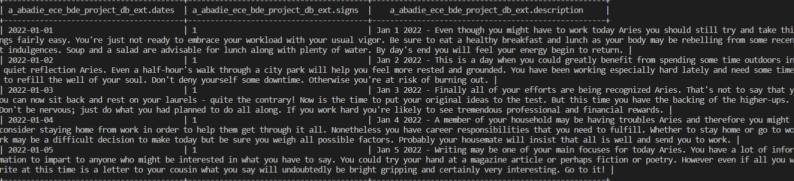
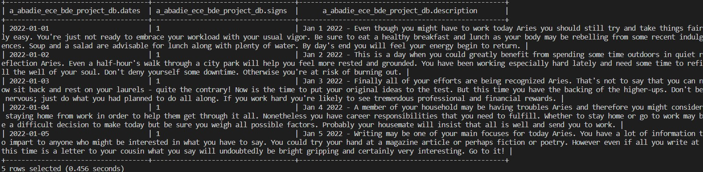

# ECE Big Data 2022 project


##	Objective

Our aim for this project was to try to create a machine learning algorithm that was able to predict an horoscope.


## Data Scrapping

To get the data required for our model to learn, we performed data scrapping on an english [horoscope website](https://www.horoscope.com/). 

During our researches, we found this website [showing How to Create a Horoscope API with Beautiful Soup and Flask in Python](https://www.freecodecamp.org/news/python-project-build-an-api-with-beautiful-soup-and-flask/). We inspired ourselves from the `get_horoscope_by_day` function in order to create a python script to get all the horoscopes generated by the website in 2022. 

On one hand we wanted to gather a big amount of data in order to have a solid training sample (that's our `init/scrap_data.py` script ) and on the other hand we wanted to have a daily scrapping script allowing us to get today's horoscope in order to increase the quality of the prediction (`daily_scrapping.py`).


## Storing the data

Using the `scrap_data.py` script let us with a big amount of data in a csv file.

The whole data file can be found in `db/data.csv`, but to give you an idea here is what a single line looks like :

|      | date       | sign | description                                                  |
| ---- | ---------- | ---- | ------------------------------------------------------------ |
|      | 01/01/2022 | 1    | Even though you might have to work today Aries you should still try and take things fairly easy. ... |

Then our next step was to store it in **HDFS**

To do so, we create an external data table with 3 columns corresponding to **date, sign and  description**

```hive
CREATE EXTERNAL TABLE ece_2022_fall_bda_1.${hiveUsername}_bde_project_db_ext (
dates string,
signs int,
description string
)
ROW FORMAT SERDE 'org.apache.hadoop.hive.serde2.OpenCSVSerde'
STORED AS TEXTFILE
LOCATION '/education/ece_2022_fall_bda_1/b.hini-ece/project/bde_project/db'
TBLPROPERTIES ('skip.header.line.count'='1');
```

The `LOCATION` command refers to the path to the folder where the csv is stored. So the newly created table already contains the data.

We check if the data is well stored : 

```hive
select * from ece_2022_fall_bda_1.${hiveUsername}_bde_project_db_ext limit 5;
```

It should print something like this : 




We want to insert more data in the table over time, so we create an **ORC** table that has the advantage to be independant from the source datafile : 

```hive
CREATE TABLE ece_2022_fall_bda_1.${hiveUsername}_bde_project_db (
dates string,
signs int,
description string)
STORED AS ORC;
```

We just have to insert all the data from the external table to the ORC table :
```hive
INSERT INTO TABLE ece_2022_fall_bda_1.${hiveUsername}_bde_project_db SELECT * FROM ece_2022_fall_bda_1.${hiveUsername}_bde_project_db_ext;
```

We check if the data is well stored in the ORC table: 
```hive
select * from ece_2022_fall_bda_1.${hiveUsername}_bde_project_db limit 5;
```

It should print something like this : 




##	Oozie orchestration

We want to create an oozie orchestration allowing us to scrap some data, add it to the ORC table and perform some machine learning every day.

To do so we create a **oozie_wf** folder composed of 3 elements:

1. a *job.properties* file
2. a *workflow.xml* file
3. a *scripts* folder

The first element contains the global data of the workflow such as the file path and the global variables

The workflow is an **XML** file containing the orchestration of the procees (i.e. the order in which each script is called)

Here is what the orchestration looks like : 


From this graph, we see that the scripts folder contains 2 files:

- daily_scrapping.py that retrieves the data of the current day and store it to a json
- beehive_script.hql that takes the data from the just created json and insert it to the ORC table

Here is the part of the workflow.xml that launches the python script:

```xml
<action name="python_node">
      <shell xmlns="uri:oozie:shell-action:0.2">
        <job-tracker>${jobTracker}</job-tracker>
        <name-node>${nameNode}</name-node>
        <exec>python3</exec>
        <file>scripts/daily_scrapping.py</file>
      </shell>
      <ok to="hql_node" />
      <error to="kill_job" />
    </action>
```

We see that if it runs succesfully it will go to the action calling the hql script : 

````xml
    <action name="hql_node">
      <hive xmlns="uri:oozie:hive-action:0.5">
        <job-tracker>${jobTracker}</job-tracker>
        <name-node>${nameNode}</name-node>
        <configuration>
          <property>
            <name>oozie.hive.defaults</name>
            <value>${hivePrincipal}</value>
          </property>
        </configuration>
        <scripts>scripts/beehive_script.hql</scripts>
        <param>hiveUsername=${hiveUsername}</param>
      </hive>
      <ok to="end" />
      <error to="kill_job" />
    </action>
````


Finally, as said earlier we want to automatically execute it daily. To do so we put our workflow in a `coordinator-app` :

````xml
<coordinator-app name="daily-workflow" frequency="0 5 * * *" start="2022-30-12T05:00Z" end="2023-30-01T05:00Z" timezone="UTC">
````

This frequency means that it will run at 5am every day from *start* = december the 30th of 2022 to *end* = january the 30th of 2023 so during 1 month.


In order to launch the orchestration we must first put the  *oozie_wf*  folder in HDFS.

```hive
hdfs dfs -put oozie_wf "/user/$USER"
```

We must be sure that the workflow.xml is in the path defined as follow in **job.properties**

 ````properties
 oozie.wf.application.path=hdfs://au/user/${clusterUsername}/oozie_wf/workflow.xml
 clusterUsername=b.hini-ece #same as $USER
 ````

then we launch it with the following command :

````bash
oozie job -run -config oozie_wf/job.properties -oozie http://oozie-1.au.adaltas.cloud:11000/oozie
````


##	The Next Step

We didn't have the time but in order to complete this project we should use **spark** to query the data from the **ORC** table.

We could then do some preprocessing and use the [sparl ML library](https://spark.apache.org/docs/1.2.2/ml-guide.html) in order to create a classification algorithm that would find the horoscope sign from the text.

Also we would automate this step by adding it to the **oozie orchestration**  so that it is launched daily


**Contact**: 

- alexandre.abadie@edu.ece.fr
- benjamin.hini@edu.ece.fr
- romain.ribeiro@edu.ece.fr
- yann.messalati@edu.ece.fr
